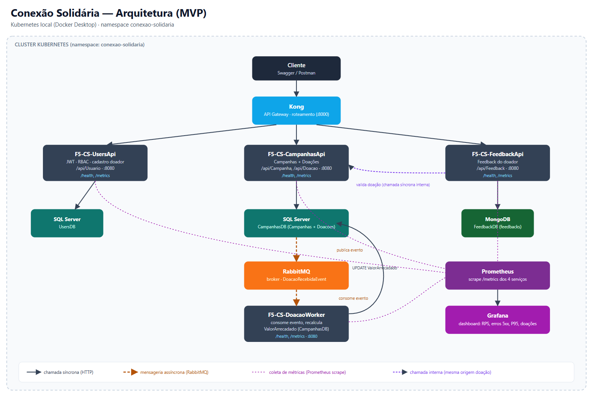

# Conexão Solidária

MVP de plataforma digital para a ONG **Esperança Solidária**, criado para o Hackathon da Pós Tech (FIAP). A ONG atua há mais de 10 anos acolhendo crianças em situação de vulnerabilidade e hoje gerencia doadores e campanhas de arrecadação manualmente — o objetivo do projeto é digitalizar isso com foco em escalabilidade, observabilidade e automação.

**Status: MVP completo e validado ponta a ponta** (2026-09-28) — 4 microsserviços, mensageria assíncrona, Kubernetes local com API Gateway e observabilidade, CI/CD. Falta só o vídeo de demonstração e o relatório de entrega. Detalhe do progresso em [`docs/checklist.md`](docs/checklist.md) e [`docs/estado-atual.md`](docs/estado-atual.md).

## Arquitetura



- Fonte editável: [`entregaveis/diagrama-arquitetura.svg`](entregaveis/diagrama-arquitetura.svg)
- Justificativa da escolha de SQL Server e MongoDB: [`entregaveis/justificativa-bancos-de-dados.pdf`](entregaveis/justificativa-bancos-de-dados.pdf)
- Decisões de arquitetura completas: [`DECISOES.md`](DECISOES.md) (mensageria em [`MENSAGERIA.md`](MENSAGERIA.md))

## Requisitos atendidos

| Requisito | Como foi feito |
|---|---|
| Autenticação/RBAC (JWT, `GestorONG`/`Doador`) | `F5-CS-UsersApi` |
| Gestão de campanhas, cadastro de doador, painel de transparência | `F5-CS-CampanhasApi` |
| Doação não atualiza o banco direto — publica evento | `F5-CS-CampanhasApi` publica `DoacaoRecebidaEvent` no RabbitMQ |
| Worker consome o evento e atualiza o valor arrecadado | `F5-CS-DoacaoWorker` (recalcula por soma, `UPDATE` idempotente) |
| ≥2 microsserviços distintos | 4 serviços: UsersApi, CampanhasApi, DoacaoWorker, FeedbackApi |
| Kubernetes (Deployments/Services/ConfigMaps) | `k8s/` — Docker Desktop Kubernetes |
| Observabilidade (`/health`/`/metrics` + Grafana com dados reais) | Prometheus + Grafana, dashboard `cs-dashboard.json` |
| CI/CD (build .NET + imagem Docker a cada push) | GitHub Actions nos 4 repos |
| **Bônus:** testes unitários no CI | UsersApi, CampanhasApi, DoacaoWorker, FeedbackApi |
| **Bônus:** API Gateway | Kong (DB-less, roteamento simples) |

## Repositórios

Cada serviço mora em seu próprio repositório público, prefixo `F5-CS-{Servico}`:

| Repositório | Responsabilidade | Banco |
|---|---|---|
| [`F5-CS-UsersApi`](https://github.com/Agonxx/F5-CS-UsersApi) | Autenticação JWT, RBAC, cadastro de doador | SQL Server (`UsersDB`) |
| [`F5-CS-CampanhasApi`](https://github.com/Agonxx/F5-CS-CampanhasApi) | Campanhas, painel de transparência, doações (publica evento) | SQL Server (`CampanhasDB`) |
| [`F5-CS-DoacaoWorker`](https://github.com/Agonxx/F5-CS-DoacaoWorker) | Consome `DoacaoRecebidaEvent`, atualiza valor arrecadado | SQL Server (`CampanhasDB`, sem ser dono do schema) |
| [`F5-CS-FeedbackApi`](https://github.com/Agonxx/F5-CS-FeedbackApi) | Feedback do doador sobre a doação | MongoDB (`FeedbackDB`) |
| Este repositório (`conexao-solidaria`) | Documentação, decisões, manifests k8s, diagrama e entregáveis | — |

## Como subir tudo localmente (Kubernetes)

Guia completo e detalhado (com troubleshooting) em [`k8s/README.md`](k8s/README.md). Resumo dos passos:

### Pré-requisitos
- Docker Desktop com Kubernetes habilitado (`Settings → Kubernetes → Enable Kubernetes`)
- `kubectl` apontando pro contexto `docker-desktop`
- Os 4 repositórios de serviço clonados junto de `conexao-solidaria`, todos em `C:\Dev\Claudia\FIAP5\` (ou ajuste os caminhos dos `docker build` abaixo)

### Passo a passo
```bash
# 1) Build das imagens (a partir de conexao-solidaria/k8s)
docker build -t f5-cs-usersapi:local     ../../F5-CS-UsersApi
docker build -t f5-cs-campanhasapi:local ../../F5-CS-CampanhasApi
docker build -t f5-cs-doacaoworker:local ../../F5-CS-DoacaoWorker
docker build -t f5-cs-feedbackapi:local  ../../F5-CS-FeedbackApi

# 2) Importar as imagens pro containerd do node (Docker Desktop não compartilha automaticamente)
for img in f5-cs-usersapi f5-cs-campanhasapi f5-cs-doacaoworker f5-cs-feedbackapi; do
  docker save "$img:local" | docker exec -i desktop-control-plane ctr -n k8s.io images import -
done

# 3) Namespace e secrets (ver k8s/README.md para os valores completos dos `kubectl create secret`)
kubectl apply -f namespace.yaml
# ... criar sqlserver-secret, usersapi-secret, campanhasapi-secret, doacaoworker-secret, feedbackapi-secret

# 4) ConfigMaps e infraestrutura
kubectl apply -f usersapi-configmap.yaml -f campanhasapi-configmap.yaml -f doacaoworker-configmap.yaml -f feedbackapi-configmap.yaml
kubectl apply -f sqlserver-deployment.yaml -f sqlserver-service.yaml
kubectl apply -f rabbitmq-deployment.yaml -f rabbitmq-service.yaml
kubectl apply -f mongo-deployment.yaml -f mongo-service.yaml
kubectl apply -f prometheus-rbac.yaml -f prometheus-configmap.yaml -f prometheus-deployment.yaml -f prometheus-service.yaml
kubectl apply -f grafana-configmap.yaml -f grafana-deployment.yaml -f grafana-service.yaml

# 5) Serviços da aplicação — ORDEM IMPORTA: Worker antes da CampanhasApi
#    (a fila do RabbitMQ só é criada quando o consumidor sobe; ver "Limitações conhecidas" abaixo)
kubectl apply -f usersapi-deployment.yaml -f usersapi-service.yaml
kubectl apply -f doacaoworker-deployment.yaml -f doacaoworker-service.yaml
kubectl apply -f campanhasapi-deployment.yaml -f campanhasapi-service.yaml
kubectl apply -f feedbackapi-deployment.yaml -f feedbackapi-service.yaml

# 6) API Gateway (Kong) — DB-less, config declarativa
kubectl apply -f kong-configmap.yaml -f kong-deployment.yaml -f kong-service.yaml

kubectl get pods -n conexao-solidaria -w
```

Aguarde todos os pods `Running` (1/1): `sqlserver`, `rabbitmq`, `mongo`, `usersapi`, `campanhasapi`, `doacaoworker`, `feedbackapi`, `prometheus`, `grafana`, `kong`.

### Acessando a aplicação

```bash
kubectl port-forward svc/kong 15000:8000 -n conexao-solidaria   # proxy Kong — ponto único de entrada da API
kubectl port-forward svc/grafana 15300:3000 -n conexao-solidaria   # admin/admin
kubectl port-forward svc/rabbitmq 15672:15672 -n conexao-solidaria # management UI, guest/guest
```

Exemplos de chamada (via Swagger/Postman, tudo passando pelo Kong em `http://localhost:15000`):
- `POST /api/Usuario/Cadastro` e `POST /api/Usuario/Auth` (login, retorna JWT)
- `GET /api/Campanha/Transparencia` (público)
- `POST /api/Campanha/Criar` (JWT de `GestorONG`)
- `POST /api/Doacao/Doar` (JWT de `Doador`)
- `POST /api/Feedback/Enviar` (JWT de `Doador`, após uma doação)

Usuário `GestorONG` seed: `gestor@esperancasolidaria.org` / `Gestor@123`.

### Load test da fila (script de demonstração)

[`scripts/load-test-doacoes.ps1`](scripts/load-test-doacoes.ps1) dispara centenas de doações concorrentes contra o Kong para mostrar o fluxo assíncrono (fila enchendo no RabbitMQ Management e sendo drenada pelo `DoacaoWorker`, contador subindo no Grafana). Requer o `port-forward` do Kong de pé e uma campanha `Ativa` já criada:

```powershell
cd scripts
powershell -ExecutionPolicy Bypass -File .\load-test-doacoes.ps1 -Count 500 -Concurrency 40
```

## Observabilidade

Prometheus descobre os 4 serviços via annotation `prometheus.io/scrape`. O dashboard do Grafana (`k8s/grafana-configmap.yaml`) traz RPS, erros 5xx, latência P95 e os contadores `doacoes_processadas_total`/`doacoes_ignoradas_total` do Worker.

## CI/CD

Cada um dos 4 repositórios de serviço tem um workflow do GitHub Actions (`.github/workflows/ci-cd.yml`) acionado a cada push na `main`: `dotnet build`, `dotnet test` (com upload do `.trx`) e `docker build` para validar a imagem. Não publica em registry — decisão explícita para não expor pacotes públicos sem necessidade, já que o requisito é só compilar e gerar a imagem no CI.

## Limitações conhecidas

- Evento publicado antes do `DoacaoWorker` subir se perde (a fila só é criada quando o consumidor sobe). Mitigado porque o Worker **recalcula** a soma das doações a cada evento — a próxima doação corrige o valor. Em produção, o ideal seria declarar a fila antecipadamente ou usar outbox pattern.
- Sem PersistentVolumes: dados de SQL Server/Mongo/RabbitMQ somem se os pods forem recriados (aceitável para demo local).
- `CampanhasApi` salva a doação e só depois publica o evento, sem transação distribuída/outbox — janela pequena de inconsistência se o processo cair entre os dois passos.

## Estrutura de pastas

```
C:\Dev\Claudia\FIAP5\
  conexao-solidaria\      <- este repo (docs, decisões, k8s, diagrama/PDF)
  F5-CS-UsersApi\
  F5-CS-CampanhasApi\
  F5-CS-DoacaoWorker\
  F5-CS-FeedbackApi\
```

## Retomando o projeto depois de clonar

```bash
gh repo clone Agonxx/conexao-solidaria
gh repo clone Agonxx/F5-CS-UsersApi
gh repo clone Agonxx/F5-CS-CampanhasApi
gh repo clone Agonxx/F5-CS-DoacaoWorker
gh repo clone Agonxx/F5-CS-FeedbackApi
```

Leia [`DECISOES.md`](DECISOES.md) e [`docs/estado-atual.md`](docs/estado-atual.md) antes de continuar o desenvolvimento.
